# epilog-gpu-validator

Check the GPUs a job just used, and drain the node if they show evidence of a
*persistent* fault, before the next job lands on them.

> **Status: not yet validated on real hardware.** Everything below has been
> exercised against a simulator, synthetic `nvidia-smi` output and fake
> `scontrol`/`nvidia-smi` binaries. No GPU and no Slurm cluster were used.
> Where the tool relies on NVIDIA or Slurm behaviour, the source is cited, and
> the [assumptions that are still unverified](#tested-with-and-assumed) are
> listed. Run `--check-config` on a real node and keep it report-only until
> its findings have been read.

```
make scenarios
```

Prints the table below. Each row runs the real decision code with `--enforce`
against a simulated `nvidia-smi` and a stand-in `scontrol` that only records
calls. No NVIDIA hardware and no Slurm are needed, and nothing is drained.

<!-- scenario-table:start -->
```
CASE                                       STATUS            WORST     EXIT DETAIL
----------------------------------------------------------------------------------------------------------------------
healthy                                    ok                unknown   0    pcie-gen:gpu0,gpu1
pcie-degraded                              ok                unknown   0    pcie-gen:gpu0,gpu1 pcie-width:gpu0
remap-pending                              ok                transient 0    row-remap-pending:gpu0 row-remap-uncorrectable:gpu0
thermal                                    ok                transient 0    throttle:gpu0
ecc-na                                     ok                unknown   0    pcie-gen:gpu0,gpu1 unreadable:gpu0
no-persistence                             ok                unknown   0    ecc-volatile-unreliable:gpu0 pcie-gen:gpu0,gpu1
no-driver                                  not-checked       unknown   0    query-failed:node
hw-slowdown                                drained           degraded  1    epilog-gpu-validator degraded: throttle:gpu0
leaked-memory                              drained           degraded  1    epilog-gpu-validator degraded: leaked-memory:gpu0
ecc                                        drained           fatal     1    epilog-gpu-validator fatal: ecc-uncorrectable:gpu0
remap-failure                              drained           fatal     1    epilog-gpu-validator fatal: row-remap-failure:gpu0
off-bus                                    drained           fatal     1    epilog-gpu-validator fatal: nvidia-smi-exit-15:node
leaked-memory --shared-gpus                ok                unknown   0    leaked-memory:gpu0 pcie-gen:gpu0,gpu1
pcie-degraded --drain-on-pcie-width        drained           degraded  1    epilog-gpu-validator degraded: pcie-width:gpu0
ecc, minors reversed                       not-checked       unknown   0    gpu-number-ambiguous:slurm-gpu0,slurm-gpu1
ecc, minors reversed --gpu-numbering nvml  drained           fatal     1    epilog-gpu-validator fatal: ecc-uncorrectable:gpu0
ecc, minors reversed --gpu-numbering minor ok                unknown   0    pcie-gen:gpu2,gpu3
ecc, minors reversed, env_uuid             drained           fatal     1    epilog-gpu-validator fatal: ecc-uncorrectable:gpu0
job GPU missing from output                partially-checked unknown   0    not-in-output:slurm-gpu1 pcie-gen:gpu0
ecc, scontrol group-writable               drain-failed      fatal     1    epilog-gpu-validator fatal: ecc-uncorrectable:gpu0
no GPUs in env                             no-gpus           ok        0    -
GPU vars disagree                          not-checked       unknown   0    gpu-set-ambiguous:node
nvidia-smi absent                          config-error      unknown   0    --nvidia-smi: /usr/bin/nvidia-smi: no such file or directory
flag typo --budget 20                      config-error      unknown   0    bad command line: invalid value "20" for flag -budget: parse error
unknown flag                               config-error      unknown   0    bad command line: flag provided but not defined: -no-such-flag
```
<!-- scenario-table:end -->

How to read it:

- **These rows show how the simulator is modelled. They are not hardware
  results.** The simulator prints the CSV that `nvidia-smi` would print, and
  that text goes through the real parser. The model rows were written from
  NVIDIA's documentation, not captured from a GPU. A healthy GPU is modelled
  *idle*: PCIe link at gen1 of gen5 (NVIDIA: current link gen and width "may
  be reduced when the GPU is not in use") and the `GpuIdle` clock-reason bit
  set.
- The simulated job holds `CUDA_VISIBLE_DEVICES=0,1`, which in the Epilog is
  Slurm's own GRES index for each GPU (see
  [Only the job's own GPUs](#only-the-jobs-own-gpus)). Every fault is placed
  on `nvidia-smi` `gpu0`, the first GPU in PCI bus order. On the simulated
  node the device files follow the same order, so Slurm's 0 is `gpu0` under
  every numbering.
- The `minors reversed` rows number `/dev/nvidiaN` in reverse PCI order, so
  `/dev/nvidia0` is `gpu3`. Slurm's 0 is then `gpu0` or `gpu3` depending on
  gres.conf, and the rows show what each `--gpu-numbering` value does with
  that. The `env_uuid` row puts the GPU UUIDs in `CUDA_VISIBLE_DEVICES` and
  the numbers in `SLURM_JOB_GPUS`, as Slurm does with gres.conf
  `Flags=env_uuid`.
- `job GPU missing from output` runs a one-GPU node for a job that holds two.
  `ecc, scontrol group-writable` has a stand-in `scontrol` that fails the
  root-safety check, so it is never run; exit 1 still has Slurm drain the node.
- DETAIL is the drain reason when there is one. Otherwise it lists the
  findings at the worst severity, in the same `check:gpuN` format.
- `README.md` is compared with `--scenario-table` output byte for byte by
  `TestREADMEScenarioTableIsCurrent`, so this table cannot drift silently.

---

## The problem

A GPU develops a fault mid-job. The job that hit it fails or, worse, silently
returns wrong numbers. Slurm marks the node idle. The next job lands on the
same card and fails the same way. Then the next.

Slurm ships no GPU health check. It provides the hooks: `HealthCheckProgram`
runs a program periodically ("Fully qualified pathname of a script to execute
as user root periodically on all compute nodes", [slurm.conf]), and the
`Epilog` runs on every job completion, on the node, "as user root". This tool
is an Epilog check.

## Prior art, and what this adds

- **[LBNL Node Health Check (NHC)][nhc]** is the usual `HealthCheckProgram`.
  It runs periodically on the whole node and can mark it offline.
- **NVIDIA DCGM health monitoring** lists "a check at job completion" among
  its common uses ([DCGM health monitoring][dcgm-health]). It covers PCIe, GPU
  memory, InfoROM, driver, thermal and power, NVLink and NVSwitch, among
  others. Per that page, its watches have to be set up before the workload
  starts.
- **DCGM diagnostics** (`dcgmi diag`) run active tests, which can catch faults
  that a passive query cannot see.

What this tool adds is narrow. It runs at every job completion rather than on
a timer. It looks only at the GPUs the finished job held. It needs nothing but
`nvidia-smi`. And its exit contract is written down and tested: a mistake in
this tool's own flags or paths (a typo, an unknown flag, a missing
`nvidia-smi`) exits 0 and cannot drain a node. That does not cover
everything that can drain the fleet. An `EpilogTimeout` shorter than
`--budget` drains every node that times out, and under `--enforce` an opt-in
drain flag (`--drain-on-pcie-width`) or a low `--max-correctable-ecc` drains
every node where it misfires. It is a complement to DCGM, not a
replacement: it has no Xid, NVLink or PCIe-replay signals, and it runs no load
test. A DCGM-backed source behind the same interface is an open item.

## Why this is a dangerous tool to write



<sub>The left branch is the one that matters. An unreadable query is a monitoring failure, and draining on it would take out the fleet.</sub>

**Slurm drains the node when Epilog exits non-zero**: "If the Epilog fails
(returns a non-zero exit code), this will result in the node being set to a
DRAIN state" ([prolog/epilog guide][prolog-epilog]). A timeout does the same:
"If the Epilog or slurm_spank_job_epilog time out, the node is drained"
([slurm.conf], EpilogTimeout).

So a false positive does not produce a bad metric. It removes a working node.
And if the cause is fleet-wide (a driver bug, a monitoring gap, a
power-management behaviour every GPU shares), it removes *every* node, one job
completion at a time, faster than anyone can react.

This is not hypothetical. NVIDIA documents that an idle GPU's current link
generation and width "may be reduced when the GPU is not in use", and 0.1.0
drained on a generation below max. On hardware that does this, every node
would drain after its next job once `--enforce` was on and `nvidia-smi` could
be found. That was not observed here: an audit reproduced it with a synthetic
idle row, and no GPU was used. Separately, 0.1.0 as shipped never found
`nvidia-smi` in the Epilog (it runs with no `PATH`), so in a real Epilog it
silently checked nothing rather than draining. Both are fixed; see the
[CHANGELOG](CHANGELOG.md).

Three rules follow.

### 1. Never drain on ignorance

If `nvidia-smi` is missing, times out, or returns something unparseable, that
is a **monitoring** failure. Draining on it would turn a broken health check
into a cluster-wide outage. The same goes for a field reported as `[N/A]`:
it is an `unknown` finding, never a healthy zero, and never evidence either.

Four `nvidia-smi` exit codes are different. The [manual][nvidia-smi] defines
them as hardware faults: 8 "A device's external power cables are not properly
attached", 10 "NVIDIA Kernel detected an interrupt issue with a GPU", 14
"infoROM is corrupted", 15 "The GPU has fallen off the bus or has otherwise
become inaccessible". Those are evidence, and they are `fatal`.

### 2. Separate persistent faults from conditions that clear

| Severity | Meaning | Drains? |
| --- | --- | --- |
| **Fatal** | Already corrupted data, or the hardware reported a fault outright | yes |
| **Degraded** | Evidence of persistent underperformance | yes |
| **Transient** | Real, but self-clearing or historic | **no** |
| **Unknown** | Could not be determined; the finding says what was not checked | **no** |

"Persistent" is a judgement made per signal type from one reading. The tool
keeps no history, so it does not observe persistence over time (see
[Limitations](#limitations)).

### 3. Only one exit is non-zero

| Situation | Exit | `status` |
| --- | --- | --- |
| A Degraded or Fatal finding, `--enforce`, real (not simulated) run | **1** | `drained`, or `drain-failed` when `scontrol` failed or was refused by the safety check (Slurm then drains on the exit code itself) |
| The same without `--enforce` | 0 | `would-drain` |
| The same under `--simulate` (never drains, even with `--enforce`) | 0 | `would-drain` |
| Every one of the job's GPUs checked, nothing drain-worthy | 0 | `ok` |
| Some of the job's GPUs checked and nothing drain-worthy, but others not checked (missing from `nvidia-smi` output, number ambiguous, MIG) | 0 | `partially-checked` |
| The job held no GPUs | 0 | `no-gpus` |
| None of the job's GPUs could be checked: query failed, timed out, ambiguous GPU set, GPU numbers ambiguous, device map unavailable | 0 | `not-checked` |
| This tool is misconfigured: bad or unknown flag, `nvidia-smi` not at `--nvidia-smi`, unknown scenario, internal panic | 0 | `config-error` |
| `--check-config` run by hand with problems | 78 | (install-time only; exits 0 whenever `SLURM_JOB_ID` is set) |

Every row is a test in `cmd/epilog-gpu-validator/main_test.go`, and
`scripts/integration.sh` runs the main rows through the shipped wrapper under
`env -i`. The wrapper adds its own guard: it passes through only 0 and 1 from
the validator, and anything else (the binary missing, not executable,
crashed) becomes 0 with a message.

`not-checked`, `partially-checked` and `config-error` exit 0 but are
**loud**. They are logged at error level to stderr, to `--log-file` and to
`--syslog`, because a quiet exit 0 would look exactly like a healthy node.

## What it checks

| Check | Severity | Why |
| --- | --- | --- |
| `nvidia-smi` exits 8, 10, 14 or 15 | fatal | Documented hardware faults (see above). It does not say which GPU, so the reason names the node |
| Uncorrectable ECC *since the last driver load* (volatile) | fatal | Corruption already reached a computation |
| Row remapping failure flag | fatal | A remap could not be applied. NVIDIA's [RMA policy][rma]: "the RMA criteria is met when the row-remapping failure flag is set and validated by the field diagnostic" |
| HW thermal slowdown or HW power brake engaged on an idle GPU | degraded | nvml.h bits `0x40` / `0x80`: a hard limit is being hit with no load at all |
| Memory still allocated after teardown (> 5% of total) | degraded | A process survived the job. Unknown with `--shared-gpus` |
| Correctable ECC since driver load above `--max-correctable-ecc` (1000) | degraded | Site policy; the counter only grows until the driver reloads |
| PCIe width below max, **only with `--drain-on-pcie-width`** | degraded | Opt-in, for sites that have confirmed idle healthy GPUs report full width |
| Uncorrectable ECC in the lifetime count only | transient when persistence mode is on and the volatile counter is readable; **unknown** otherwise | Historic, if none since the last driver load. Without persistence mode the volatile counter may have reset after the job, so whether any came from this job cannot be told. The manual: "After each reboot persistence mode will default to 'Disabled'" |
| Rows remapped after uncorrectable errors | transient | A lifetime count; remapping is the designed repair |
| Row remap pending | transient | "The GPU must be reset for the remapping to go into effect". Degraded with `--drain-on-pending-remap` |
| SW thermal slowdown, SW power cap, board limit, reliability policy, or the bare `hw_slowdown` bit | transient | Self-clearing or policy. nvml.h says `hw_slowdown` "May be also reported during PState or clock change" |
| Temperature at or above `--max-temperature` (90°C) | transient | Usually airflow, not the card |
| PCIe generation or width below max | **unknown** | "These may be reduced when the GPU is not in use", and the Epilog only runs when it is not |
| Persistence mode disabled | unknown | Volatile counters reset when the driver unloads, so a zero volatile count proves nothing |
| Any field reported as `[N/A]`, `[Not Supported]` or unparseable | unknown | Named in the finding (e.g. ECC off, or remap fields on pre-Ampere cards) |

The thresholds (1000 correctable errors, 5% memory, 90°C) are starting points
for site policy. They have not been validated against fleet data.

Volatile versus aggregate ECC is a distinction worth labouring. The
[nvidia-smi manual][nvidia-smi] says volatile counters "track the number of
errors detected since the last driver load", and "On Linux the driver unloads
when no active clients exist" unless persistence mode is on. At Epilog time
the job's clients are gone. So errors from the job only reliably show in the
volatile counter when persistence mode is enabled, and the tool says so when
it is not.

`gpuN` in a reason or finding is the NVML index, the number `nvidia-smi -i N`
takes. `slurm-gpuN` is Slurm's number for a GPU that was not matched to one.
The JSON record also carries each GPU's UUID, PCI bus ID and Slurm GPU number.
A runbook for each check is in [docs/runbook.md](docs/runbook.md).

## Only the job's own GPUs

On a shared node, checking every GPU means a neighbour's faulty card drains
the node for a job that never touched it. So the tool checks only the GPUs
the Epilog environment names, and it checks **nothing** it cannot tie to the
job without guessing.

- **What Slurm puts in the Epilog.** `CUDA_VISIBLE_DEVICES` and
  `SLURM_JOB_GPUS` hold Slurm's own GRES index for each GPU. This comes from
  Slurm's source, not its docs: `gres_common_prep_set_env()` in
  `src/plugins/gres/common/gres_common.c` writes `gres_device->index` into
  both (read at SchedMD master `9f9da53` and at the `slurm-23-02-7-1`,
  `slurm-24-05-8-1` and `slurm-25-05-3-1` tags). `GPU_DEVICE_ORDINAL` is also
  read; the [prolog/epilog guide][prolog-epilog] says "The considerations for
  CUDA_VISIBLE_DEVICES also apply to GPU_DEVICE_ORDINAL". When more than one
  is set, they must agree, or nothing is checked.
- **Which GPU a number means depends on gres.conf.** It is not always
  `nvidia-smi`'s number, and not always the `N` in `/dev/nvidiaN`.
  - [gres.conf][gres.conf], under Links: "the minor number assigned by the OS
    and used in the device file (i.e. the X in /dev/nvidiaX) is not
    necessarily the same as the device number/index. The device number is
    created by sorting the GPUs by PCI bus ID". With `AutoDetect=nvml`, Slurm
    orders GPUs by NVML's enumeration ("a stand-in for PCI bus ID order", in
    `src/plugins/gres/gpu/gres_gpu.c`), and NVML's numbers "are assigned via
    PCI bus ID, from lowest to highest" ([gres guide][gres]). Slurm's N is then
    `nvidia-smi` index N.
  - The [gres guide][gres]'s own Epilog example is a job allocated
    `/dev/nvidia1` that sees `CUDA_VISIBLE_DEVICES=1`. Without AutoDetect the
    source numbers GPUs in the order of gres.conf's `File=` lines, which the
    guide asks to be "in the increasing numeric order". Slurm's N is then
    `/dev/nvidiaN`.
  - The two agree when the node's device minors follow PCI bus order. The
    gres guide says the mapping between them "is nondeterministic and system
    dependent".
- **`--gpu-numbering` says which applies.** `slurmd -G` prints this node's
  GRES configuration ("based upon slurm.conf GRES merged with gres.conf
  contents for this node", [slurmd]), which is where to check.

  | Value | Slurm GPU N is | For |
  | --- | --- | --- |
  | `auto` (default) | checked only where `/dev/nvidiaN` and `nvidia-smi` index N are the same GPU on this node | Any node whose device minors follow PCI order. Elsewhere it checks no numbered GPU (`gpu-number-ambiguous`), and `--check-config` fails |
  | `nvml` | `nvidia-smi` index N | gres.conf `AutoDetect=nvml` covering every GPU |
  | `minor` | `/dev/nvidiaN`, via `/proc/driver/nvidia/gpus/<pci-address>/information` (NVIDIA's [MIG guide][mig-proc]: it "contains a "Device Minor" field") | gres.conf without AutoDetect, whose `File=` lines cover every GPU in increasing device order |
  | `uuid` | not used; only GPU UUIDs are checked | gres.conf `Flags=env_uuid` |

  No value is right for a gres.conf that lists `File=` lines out of device
  order, or leaves some of the node's GPUs out. Use UUIDs there. 0.1.0 read
  the numbers as `nvidia-smi` indices, which is `nvml`.
- **UUIDs are best.** With gres.conf `Flags=env_uuid`, `CUDA_VISIBLE_DEVICES`
  holds GPU UUIDs instead ("Add option to use UUID strings with
  CUDA_VISIBLE_DEVICES", [26.05 changelog], so Slurm 26.05 and later).
  gres.conf says it "Requires the use of AutoDetect so that UUIDs are
  available". A UUID names one device whatever the numbering, and
  `nvidia-smi` identifies GPUs by "the GPU's UUID" too; NVIDIA recommends UUID
  or PCI bus ID "since device enumeration ordering is not guaranteed to be
  consistent between reboots". `SLURM_JOB_GPUS` still holds numbers then, so
  a UUID list and a number list only have to name the same number of GPUs,
  and the UUIDs are used. `MIG-` entries are reported and not checked (no MIG
  support).
- **One query, filtered.** The manual documents `-i` as selecting "a single
  specified GPU". So the tool queries the whole node once and picks out the
  job's GPUs, rather than relying on a comma-separated `-i` list. A job GPU
  missing from otherwise good output is `unknown`, not evidence, and the run
  is `partially-checked` (or `not-checked` if nothing was checked). The
  manual documents exit 15 as "The GPU has fallen off the bus or has
  otherwise become inaccessible", and that exit is handled as evidence.
  Whether a `--query-gpu` run over several GPUs exits 15 when one of them is
  lost, rather than printing an unreadable row, has not been observed here
  (see [Tested with, and assumed](#tested-with-and-assumed)).
- **The one node-wide signal.** A hardware-fault exit code (8/10/14/15) is not
  attributed to any GPU, because `nvidia-smi` does not say which one. It
  drains the node under `--enforce` even when the lost GPU was a neighbour's.
  A GPU that has dropped off the bus is a node problem whoever used it last.
- **Shared GPUs.** With gres/mps or shards, "the same GPU can be allocated ...
  to multiple jobs" ([gres guide][gres]). Memory still in use may then belong
  to a job that is still running. `--shared-gpus` makes that `unknown` rather
  than `degraded`. The tool also does this by itself when
  `SLURM_SHARDS_ON_NODE` or `CUDA_MPS_ACTIVE_THREAD_PERCENTAGE` is set. The
  [prolog/epilog guide][prolog-epilog] documents
  `CUDA_MPS_ACTIVE_THREAD_PERCENTAGE` as "Available in Prolog and Epilog
  only" (when gres/mps is configured and the job requests it).
  `SLURM_SHARDS_ON_NODE` is documented only for steps ([gres guide][gres]);
  that it reaches the Epilog is unverified.

## Install

```bash
make install                                   # /usr/local/bin/epilog-gpu-validator
install -d -m 0755 /etc/slurm/epilog.d         # install does not create it
install -m 0755 deploy/epilog.sh /etc/slurm/epilog.d/50-gpu-validate
```

Tagged releases also get static linux/amd64 and linux/arm64 binaries with
SHA-256 checksums from `.github/workflows/release.yml`. That workflow has not
run on a real tag yet.

```conf
# slurm.conf
Epilog=/etc/slurm/epilog.d/*
EpilogTimeout=60          # Slurm 25.05 and later
# PrologEpilogTimeout=60  # before 25.05 (it also bounds the Prolog)
```

- **Do not replace your existing Epilog.** [slurm.conf] allows two ways to
  run more than one. A glob: "A glob pattern (See glob (7)) may also be used
  to run more than one epilog script (e.g. "/etc/slurm/epilog.d/*"). When more
  than one epilog script is configured, they are executed in reverse
  alphabetical order (z-a -> Z-A -> 9-0)." Or several lines: "NOTE: It is
  possible to configure multiple epilog scripts by including this option on
  multiple lines." The second form leaves an existing `Epilog=` line alone:
  add `Epilog=/etc/slurm/epilog.d/50-gpu-validate` on a line of its own. With
  the glob, move the site's existing scripts into the directory and name them
  for the order you want.
- **Timeout.** `EpilogTimeout` was added in Slurm 25.05 ("Added slurm.conf
  parameters PrologTimeout and EpilogTimout", [25.05 changelog]). Before that,
  `PrologEpilogTimeout` covers both hooks, and its 21.08 man page says "The
  default behavior is to wait indefinitely". Either way it must comfortably
  exceed the wrapper's `--budget` (20s). If Slurm kills the check mid-run,
  the node is drained for a check that never reached a conclusion.
- **Paths.** Slurm runs the Epilog with no search path: "for security reasons,
  these programs do not have a search path set" ([prolog/epilog
  guide][prolog-epilog]). So `nvidia-smi` and `scontrol` are absolute-path
  flags, defaulting to `/usr/bin/nvidia-smi` and `/usr/bin/scontrol`. Those
  are common, not universal (a from-source build installs wherever its
  `--prefix` pointed). Check yours with `command -v nvidia-smi scontrol` and set
  `NVIDIA_SMI` / `SCONTROL` at the top of the wrapper. The tool also refuses
  to run a binary that is writable by group or others, or owned by anyone but
  root or the invoking user, because the Epilog runs as root. An `nvidia-smi`
  that fails this is a `config-error` (nothing checked, exit 0). An `scontrol`
  that fails it is never run: under `--enforce` a drain then relies on exit 1
  and Slurm's own Epilog-failure drain (status `drain-failed`, Slurm's generic
  reason). `scontrol` is checked again right before it would run.
- **Set `--gpu-numbering`** if gres.conf numbers GPUs differently from this
  node's device files (see [Only the job's own GPUs](#only-the-jobs-own-gpus)),
  through `EXTRA_ARGS` in the wrapper.
- **Check it by hand first**, on a GPU node, with the wrapper's paths:

  ```bash
  /usr/local/bin/epilog-gpu-validator --check-config \
      --nvidia-smi /usr/bin/nvidia-smi --scontrol /usr/bin/scontrol \
      --log-file /var/log/epilog-gpu-validator.jsonl --syslog
  ```

  It checks the paths, the log destinations and the device map. It runs the
  real query once and reports any field the driver rejects or leaves `[N/A]`.
  Under `--gpu-numbering auto` (the default) it fails when the device map
  cannot be read, or when this node's device minors do not follow PCI bus
  order, because either way no job given GPU numbers would be checked. It
  exits 78 on a problem (0 when `SLURM_JOB_ID` is set, so it can never drain
  a node if pasted into the Epilog by mistake). `config ok` covers only what
  it lists; it cannot see gres.conf.

### Report-only first, and where the findings go

**Report-only is the default** (`ENFORCE=0` in the wrapper). A health check
that starts draining nodes on the day it is installed does not get installed
twice. Run it for a week, read the findings, then set `ENFORCE=1`.

The current Slurm prolog/epilog guide does not say what happens to Epilog
stdout and stderr (checked 2026-09-26). So the findings are written to places
you control:

- `--log-file` appends one JSON record per run. The wrapper uses
  `/var/log/epilog-gpu-validator.jsonl`.
- `--syslog` sends a one-line summary per run, tag `epilog-gpu-validator`,
  at `err` for `not-checked`/`partially-checked`/`config-error`/`drained`/
  `drain-failed`, at `warning` for `would-drain`, and at `info` otherwise.
  Jobs without GPUs are not logged there. The per-GPU findings, UUIDs and bus
  IDs are only in the JSON record.

To see what enforcement would have done, and which runs did not check all of
the job's GPUs:

```bash
grep '"status":"would-drain"' /var/log/epilog-gpu-validator.jsonl
grep -E '"status":"(not-checked|partially-checked|config-error)"' /var/log/epilog-gpu-validator.jsonl
```

Flags that come before a mistyped one still take effect, so the wrapper
passes `--syslog` and `--log-file` first. A later typo is then still reported
where you look.

By hand at a shell there is no job, so no GPU variable is set and a plain run
reports `no-gpus` without querying anything. Either check the whole node, or
set the variable an Epilog would get:

```bash
epilog-gpu-validator --all-gpus --json --nvidia-smi /usr/bin/nvidia-smi   # every GPU on the node; report only
CUDA_VISIBLE_DEVICES=0,1 epilog-gpu-validator --json --nvidia-smi /usr/bin/nvidia-smi   # as the Epilog of a job that held Slurm GPUs 0 and 1
epilog-gpu-validator --simulate ecc --json                                # no hardware; never drains
```

Leave `--enforce` to the wrapper (`ENFORCE=1`): by hand it drains the node
you are on.

Useful knobs:

| Flag | For |
| --- | --- |
| `--nvidia-smi`, `--scontrol` | Absolute tool paths (the Epilog has no `PATH`) |
| `--log-file`, `--syslog` | Where each run's record goes |
| `--budget` (20s), `--query-timeout` (10s) | Whole-run limit, and the part `nvidia-smi` may use; the rest is left for `scontrol` |
| `--allow-pcie-downgrade` | Do not report PCIe links below max at all |
| `--drain-on-pcie-width` | Drain on a narrow idle link; only after confirming idle healthy GPUs report full width on your hardware |
| `--max-correctable-ecc`, `--max-temperature` | Site thresholds |
| `--drain-on-pending-remap` | Drain rather than batch the reset |
| `--shared-gpus` | GPUs shared between jobs (gres/mps, shards) |
| `--all-gpus` | Check the whole node, not just the job's cards |
| `--gpu-numbering` (`auto`) | What Slurm's GPU numbers mean on this node: `auto`, `nvml`, `minor` or `uuid` (see [Only the job's own GPUs](#only-the-jobs-own-gpus)) |
| `--driver-proc-dir` | Where the driver lists GPUs, read by `--gpu-numbering auto` and `minor` (tests, unusual container layouts) |

## Tested with, and assumed

| Component | What was actually run |
| --- | --- |
| Go | Locally: go1.26.3 darwin/arm64, with `go.mod` at `go 1.22.0` (`go vet` checks standard-library use against that version). CI: 1.22 and stable, not yet observed on this change |
| GPUs, NVIDIA driver, `nvidia-smi` | **None.** Synthetic rows and fake binaries only |
| Slurm | **None.** Behaviour taken from the current docs, the 25.05 and 26.05 changelogs, the 21.08 man page and Slurm's source (the files named above), all cited above |
| OS | Linux is assumed (`/proc/driver/nvidia`). The tests also pass on macOS with fakes |

Assumptions that no one has checked against real hardware yet:

- that `--query-gpu` accepts every field this tool asks for on your driver.
  The `remapped_rows.*` fields are documented under `--query-remapped-rows`;
  if the driver rejects one, `nvidia-smi` exits 2 and every run is
  `not-checked`. `--check-config` shows this at install time.
- the CSV spelling of `remapped_rows.pending` / `.failure`. Both `Yes`/`No`
  and numbers are accepted.
- that Slurm's GRES numbering is one of the two `--gpu-numbering nvml` and
  `minor` describe. That is read from Slurm's source and docs, not observed:
  a gres.conf that lists `File=` lines out of order, or leaves GPUs out,
  fits neither, and only UUIDs (`Flags=env_uuid`) are safe there.
- that `/proc/driver/nvidia/gpus` is visible where the Epilog runs (see
  Slinky below).
- how `nvidia-smi` actually behaves when one GPU is lost: the exit code 15 is
  documented, but has not been observed here.

## Running under Slinky or a containerised slurmd

Untested; no Kubernetes cluster was available. If slurmd runs in a container
(for example under [Slinky](https://github.com/SlinkyProject/slurm-operator)), the Epilog
runs inside that container, and these need checking before trusting the tool:

- `nvidia-smi` must exist in the slurmd image at the configured path, and
  must see the node's GPUs.
- `/proc/driver/nvidia/gpus` must be visible inside the container for
  `--gpu-numbering auto` (the default) or `minor`. Without it, every job
  given GPU numbers is `not-checked`. `--driver-proc-dir` can point elsewhere
  if a runtime mounts it elsewhere; `--gpu-numbering nvml` and `uuid` do not
  read it.
- `scontrol` must reach slurmctld from inside the container, for `--enforce`.
- A Slurm drain does not cordon or taint the Kubernetes node. Whether it
  should is an open design question.

## Limitations

- **NVIDIA only**, via `nvidia-smi`. No ROCm, no Habana.
- **Idle-time checks only.** PCIe link state, and anything else that only
  shows under load, cannot be judged at Epilog time. A genuinely downtrained
  link needs an active test: DCGM diagnostics, or a periodic drain-and-test
  job. Load tests are deliberately out of scope here.
- **No Xid events.** Parsing them out of the kernel log is fragile, and it
  cannot tie an event to one job. The proper sources are NVML's event API
  (`nvmlEventTypeXidCriticalError` in nvml.h) or DCGM health watches. Both
  need a watcher running *during* the job, not a check after it.
- **No history.** Every run is one snapshot. "Persistent" is a per-signal
  judgement, not something the tool observes. Correctable-ECC counts are
  compared as totals since driver load, not per job.
- **No fleet-level circuit breaker.** Each node decides alone. If a new
  fleet-wide false positive appears, report-only mode is the protection.
- **No MIG awareness.** `MIG-` identifiers are reported and not checked.
- **Pre-Ampere page retirement** (`retired_pages.*`) is not queried. On those
  cards the remap fields read `[N/A]` and show up as `unknown`.
- **Never un-drains.** Bringing a node back is a human decision; see
  [docs/runbook.md](docs/runbook.md).

## Development

```bash
make check        # gofmt check, go vet, go test -race, scripts/integration.sh
make scenarios    # the table above
make shellcheck   # deploy/epilog.sh and scripts/integration.sh
```

The GPU source is an interface, and the simulator implements it by printing
`nvidia-smi` CSV into the real parser. So every classification branch can be
reached without a broken card to hand. CI runs:

- `gofmt`, `go vet` and `go test -race` on Go 1.22 and stable;
- staticcheck, govulncheck and shellcheck;
- `scripts/integration.sh`, which runs the shipped wrapper and binary under
  `env -i` with fake `nvidia-smi`/`scontrol` and a fake `/proc` device map.
  It asserts that an idle healthy GPU exits 0 under `--enforce`, that a
  missing `nvidia-smi` or a flag typo exits 0 and is logged, that a
  neighbour's fault does not drain, what each `--gpu-numbering` value does on
  a node whose device minors are not in PCI order, that an `env_uuid` job is
  checked, that a group-writable `scontrol` is never run, and that a hung
  `nvidia-smi` returns within 4 seconds as `date +%s` counts them, against a
  2s budget (the code may wait up to 1s past the deadline to reap the child,
  and the clock has 1-second resolution).

All of this runs against synthetic output. It shows the code does what the
docs above say. It does not show that real `nvidia-smi` output matches the
synthetic rows. That needs rows captured on real hardware, labelled with GPU
model and driver version, added as test fixtures.

## The set

Part of a set of tools covering the lifecycle of a GPU allocation, each built on
the same rule: never act on absent evidence.

- **epilog-gpu-validator**: this repo. Hardware faults *between* jobs, from
  a passive `nvidia-smi` reading.
- **[gpu-reaper](https://github.com/Zhanyl-tech/gpu-reaper)**: the companion
  that catches wasted GPUs *during* a job. Neither tool runs an active load
  test; DCGM diagnostics (`dcgmi diag`) are the place for that.
- **[ib-slurm-exporter](https://github.com/Zhanyl-tech/ib-slurm-exporter)**:
  fabric problems attributed to the job causing them.
- **[slurm-scheduler-lab](https://github.com/Zhanyl-tech/slurm-scheduler-lab)**:
  the scheduling policy that decides what runs in the first place.

## License

MIT

[slurm.conf]: https://slurm.schedmd.com/slurm.conf.html
[prolog-epilog]: https://slurm.schedmd.com/prolog_epilog.html
[gres]: https://slurm.schedmd.com/gres.html
[gres.conf]: https://slurm.schedmd.com/gres.conf.html
[slurmd]: https://slurm.schedmd.com/slurmd.html
[25.05 changelog]: https://github.com/SchedMD/slurm/blob/master/CHANGELOG/slurm-25.05.md
[26.05 changelog]: https://github.com/SchedMD/slurm/blob/master/CHANGELOG/slurm-26.05.md
[nvidia-smi]: https://docs.nvidia.com/deploy/nvidia-smi/index.html
[mig-proc]: https://docs.nvidia.com/datacenter/tesla/mig-user-guide/latest/device-nodes-and-capabilities.html
[rma]: https://docs.nvidia.com/deploy/a100-gpu-mem-error-mgmt/rma-policy-thresholds-for-row-remapping.html
[dcgm-health]: https://docs.nvidia.com/datacenter/dcgm/latest/learn/modules/health-monitoring.html
[nhc]: https://github.com/mej/nhc
